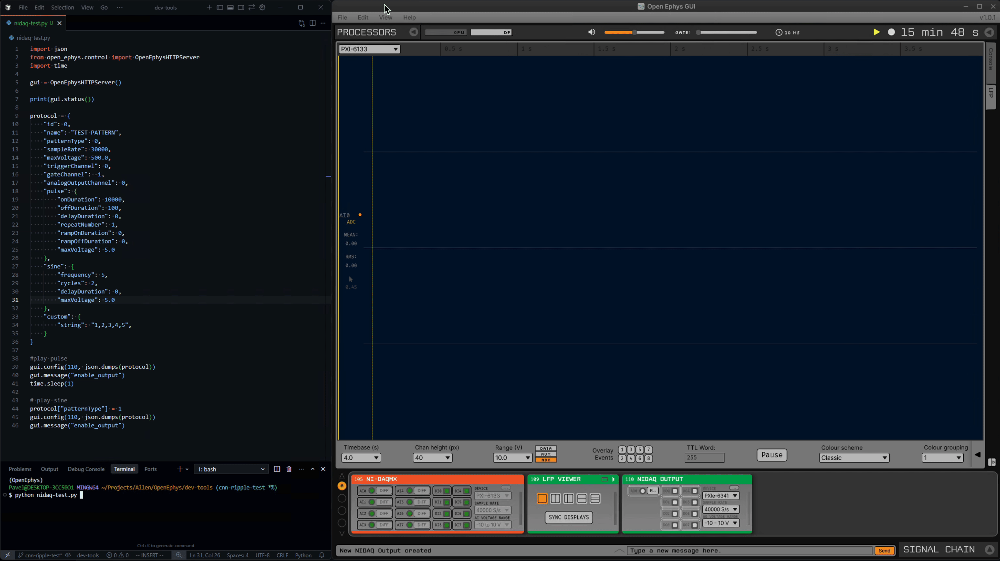

## NI-DAQ Output Plugin

Stimulus output on NI-DAQ devices based on https://github.com/open-ephys-plugins/opto-stim-schema.git

This plugin is currently a pre-release and has been developed using a PXIe-6341 card.

Please open an issue if you have an NI device you’d like to use that is not working as expected.

NIDAQ Output currently operates in immediate mode such that analog and digital data is output as soon as it is available without any synchronization.